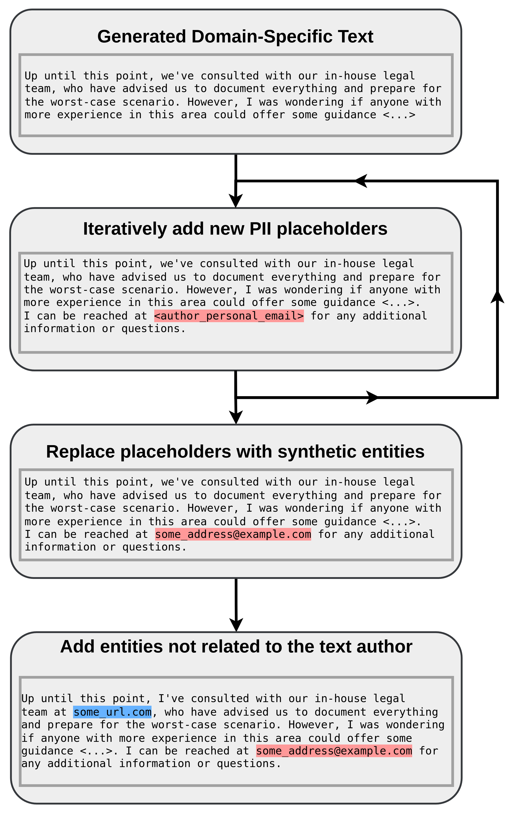

# SPY: Enhancing Privacy with Synthetic PII Detection Dataset

We proudly present the **SPY Dataset**, a novel synthetic dataset for the task of **Personal Identifiable Information (PII)** detection. This dataset highlights the importance of safeguarding PII in modern data processing and serves as a benchmark for advancing privacy-preserving technologies.

## Key Highlights

- **Innovative Generation:** We present a methodology for developing the SPY dataset and compare it to other methodologies used for creating synthetic PII datasets. Our approach does not require any external data and can be applied to any knowledge domain.
- **Benchmark for PII Detection:** We open-source the SPY dataset containing 4,491 medical consultations and 4,197 questions in the legal domain, specifically developed to highlight the contrast between average named entity recognition tasks and more fine-grained PII detection.

## Dataset Storage and Dynamic Entity Generation

The dataset is stored with **placeholders instead of entities**, and entities are dynamically generated using the **[Python Faker](https://pypi.org/project/Faker/)** library when loading the dataset with the `load_dataset` function. The `faker_random_seed` controls the reproducibility of the synthetic entity generation, ensuring consistent outputs across multiple runs.

### Example: Loading the Dataset
```python
from datasets import load_dataset

# Load the SPY dataset with dynamic entity generation
dataset = load_dataset("spy.py", trust_remote_code=True, split="medical_consultations", faker_random_seed=0)
print(dataset)
```
This example demonstrates how to use the Hugging Face `datasets` library to load the dataset. The `faker_random_seed` ensures reproducibility when generating synthetic entities.

<div style="text-align: center;">
    
</div>

## Dataset Statistics

| **Entity type** | **Legal Questions** | **Medical Consultations** |
|----------------|----------------------|---------------------------|
| url            | 4243                 | 4322                      |
| email          | 4101                 | 4493                      |
| username       | 3868                 | 4273                      |
| address        | 4173                 | 5122                      |
| name           | 4032                 | 4707                      |
| phone number   | 3597                 | 4222                      |
| id_num         | 3357                 | 4284                      |
*Table: Number of generated PII entities by type.*

## Data Format

The dataset is divided into two files, categorized by domain:

1. **Legal Questions Dataset**
2. **Medical Consultations Dataset**

Additionally, small sample-size files are provided for both domains.

### **File Structure**
The dataset is stored in **.jsonl** format, where each line contains a dictionary with the following keys:

- **tokens:** A list of tokens created by splitting the generated text by whitespace.
- **trailing_whitespace:** A boolean indicating whether a token has trailing whitespace.
- **labels:** A list of integer labels for each token.
- **ent_tags:** A list of BIO-tags for each token.

